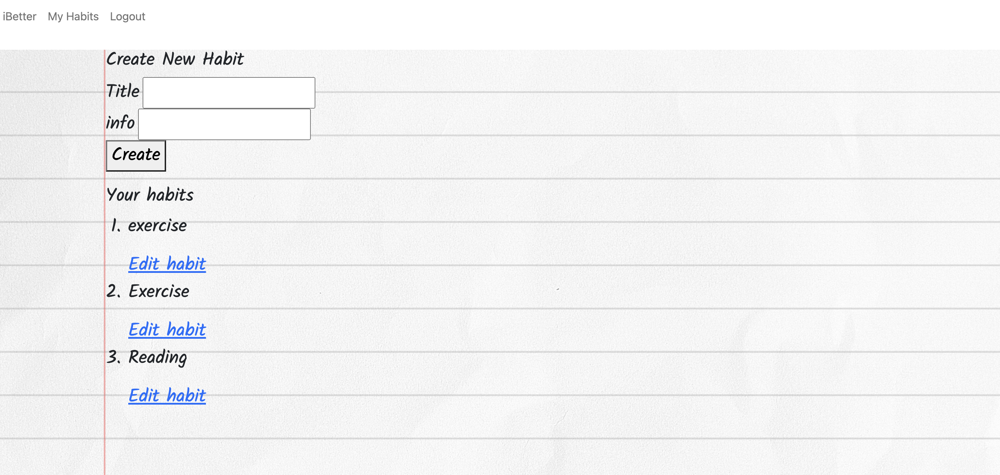
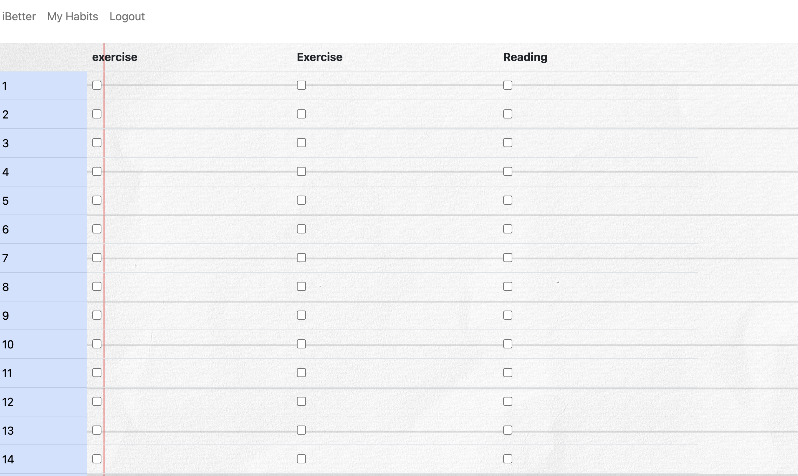

# iBetter


<details>
<summary>Table of Content</summary>

- [Overview](#overview)
  - [Description](#description)
  - [Installation](#installation)
  - [Usage](#usage)
  - [Testing](#testing)
  - [The challenge](#the-challenge)
  - [Screenshot](#screenshot)
  - [Links](#links)
  - [contribution guidelines](#contribution-guidelines)
- [We process](#we-process)
  - [Built with](#built-with)
  - [What we learned](#what-we-learned)
- [Questions](#questions)
- [Author](#author)

</details>

## Overview

### Description

iBetter was developed to help you be better at tracking and accomplishing your good habits. This app features a user-friendly and easy to use interface, that will let you simply check off each habit you accomplished each day. We do ask you to sign up to our site, but don't worry we encrpyt all passwords for your safety.

As a secured logged in user, you can create habits, edit them, and track your progress through the month by simply checking the checkbox for the corresponding habit and date. When you add a new habit, you get a new column of checkboxes. There is a chart included as well so you can see your progress for each habit.

### Installation

If anyone ever wants to look at the application, you have to clone it to your own local machine and run it from there.
1. Select a local directory to save the file and clone it from Github: https://github.com/Vinyldude8896/iBetter 
2. Open with VS Code, put the .env example renamed to .env, and type the database information in it.
3. Enter npm i on the VS Code command line to install the required resource packages.
4. Enter npm start in command line.
5. Open a webpage, the URL: http://localhost:3001/ 

### Usage

The application will be deployed on Heroku, the live application is at this link: https://murmuring-caverns-89581.herokuapp.com/

### Testing

Clone it to your own local machine and enter npm start in command line.
Multiple days were spent testing to ensure the interface was responsive and clean. Also to ensure the data being written to and from the database is correct.

### The challenge

Users should be able to:

- login and logout the site
- create habits
- edit and delete habits by the user
- check the completed habit, and see the corresponding habit progress

### Screenshot





### Links

- Solution URL: [https://github.com/Vinyldude8896/iBetter](https://github.com/Vinyldude8896/iBetter)
- Deployed URL: [https://murmuring-caverns-89581.herokuapp.com/](https://murmuring-caverns-89581.herokuapp.com/)

### Contribution Guidelines

We do not have contributions set up as of yet.

## We process

### Built with

- Handlebars
- CSS
- JavaScript

### What we learned

- find suitable resource packs
- built table on handlebars 

To see how I add code snippets, see below:

```Handlebars
<div class="tablebox">
  <table id="results_table" class="table">
    <thead>
      <th></th>
      {{#each habits}}
        <th class="Kalam-font">{{habit_title}}</th>
      {{/each}}
    </thead>
    <tbody>
    <tr>
        <td class="table-primary" name="day1" id="day1" scope="col">1</td>
        {{#each habits}}
          <td>
            <input type="checkbox" name="1" id="{{id}}" {{{isChecked id '1' ../results}}} />
          </td>
        {{/each}}
      </tr>
      <tr>
        <td class="table-primary " name="day2" id="day2" scope="col">2</td>
        {{#each habits}}
          <td>
            <input type="checkbox" name="2" id="{{id}}" {{{isChecked id '2' ../results}}} />
          </td>
        {{/each}}
      </tr>
    </tr>
    </tbody>
  </table>
</div>
```

## Questions
Please feel free to reach out to any of our four collaborators if you have any questions
  - additional instructions 

## Author

- Github - [Kevin Reid](https://github.com/Vinyldude8896)
- Github - [Katie Butler](https://github.com/katiebutler37)
- Github - [Rheneadianne](https://github.com/rheneadianne)
- Github - [Longyang Wang](https://github.com/YangLongWang)
