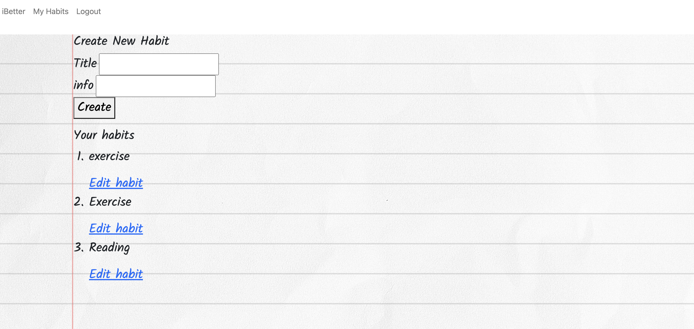
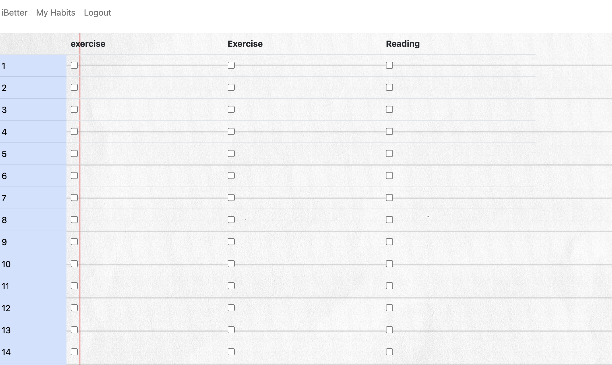

# iBetter

### iBetter was developed to help you be better at tracking and accomplishing your good habits. This app features a user-friendly and easy to use interface, that will let you simply check off each habit you accomplished each day. We do ask you to sign up to our site, but don't worry we encrpyt all passwords for your safety.
### As a secured logged in user, you can create habits, edit them, and track your progress through the month by simply checking the checkbox for the corresponding habit and date. When you add a new habit, you get a new column of checkboxes. There is a chart included as well so you can see your progress for each habit.

### badges

## Table of Contents

- [installation](#installation)
- [contribution guidelines](#contribution)
- [Test Instructions](#testing)
- [License](#license)
- [Questions](#questions)

### Installation
Live application is at this link :
https://murmuring-caverns-89581.herokuapp.com/

### Contribution Guidelines
We do not have contributions set up as of yet.
### Testing
Multiple days were spent testing to ensure the interface was responsive and clean. Also to ensure the data being written to and from the database is correct.
### Questions
    Please feel free to reach out to any of our four collaborators if you have any questions
    - additional instructions 
   

### Images of example readme.md

